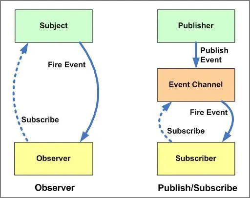

### 写在前面

> 此系列来源于开源项目：[前端 100 问：能搞懂 80%的请把简历给我](https://github.com/yygmind/blog/issues/43)
> 为了备战 2021 春招
> 每天一题，督促自己
> 从多方面多角度总结答案，丰富知识
> [介绍下观察者模式和订阅-发布模式的区别，各自适用于什么场景](https://github.com/Advanced-Frontend/Daily-Interview-Question/issues/25)
> 简书整合地址：[前端 100 问](https://www.jianshu.com/c/70e2e00df1b0)

### 正文回答

观察者模式中主体和观察者是互相感知的，发布-订阅模式是借助第三方来实现调度的，发布者和订阅者之间互不感知

#### 观察者设计模式

> **观察者模式** 在软件设计中是一个对象，维护一个依赖列表，当任何状态发生改变自动通知它们。

我们假设你正在找一份软件工程师的工作，对“香蕉公司”很感兴趣。所以你联系了他们的 HR，给了他你的联系电话。他保证如果有任何职位空缺都会通知你。这里还有几个候选人也你一样很感兴趣。所以职位空缺大家都会知道，如果你回应了他们的通知，他们就会联系你面试。

所以，以上和“观察者模式”有什么关系呢？这里的“香蕉公司”就是 Subject，用来维护 Observers（和你一样的候选人），为某些 event（比如职位空缺）来**通知（notify）**观察者。

#### 发布-订阅设计模式

在观察者模式中的 Subject 就像一个发布者（Publisher），观察者（Observer）完全和订阅者（Subscriber）关联。subject 通知观察者就像一个发布者通知他的订阅者。这也就是很多书和文章使用“发布-订阅”概念来解释观察者设计模式。但是这里还有另外一个流行的模式叫做发布-订阅设计模式。

它的概念和观察者模式非常类似。最大的区别是：

> 在发布-订阅模式，消息的发送方，叫做发布者（publishers），消息不会直接发送给特定的接收者，叫做订阅者。

意思就是发布者和订阅者不知道对方的存在。需要一个第三方组件，叫做信息中介，它将订阅者和发布者串联起来，它过滤和分配所有输入的消息。换句话说，发布-订阅模式用来处理不同系统组件的信息交流，即使这些组件不知道对方的存在。
