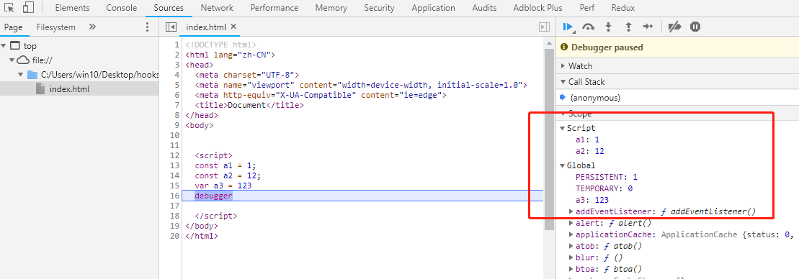

### 写在前面

> 此系列来源于开源项目：[前端 100 问：能搞懂 80%的请把简历给我](https://github.com/yygmind/blog/issues/43)
> 为了备战 2021 春招
> 每天一题，督促自己
> 从多方面多角度总结答案，丰富知识
> [关于 const 和 let 声明的变量不在 window 上](https://github.com/Advanced-Frontend/Daily-Interview-Question/issues/30)
> 简书整合地址：[前端 100 问](https://www.jianshu.com/c/70e2e00df1b0)

### 正文回答

在 ES5 中，顶层对象的属性和全局变量是等价的，var 命令和 function 命令声明的全局变量，自然也是顶层对象。

```js
var a = 12;
function f() {}

console.log(window.a); // 12
console.log(window.f); // f(){}
```

但 ES6 规定，var 命令和 function 命令声明的全局变量，依旧是顶层对象的属性，但 let 命令、const 命令、class 命令声明的全局变量，不属于顶层对象的属性。

```js
let aa = 1;
const bb = 2;

console.log(window.aa); // undefined
console.log(window.bb); // undefined
```



通过上图也可以看到，在全局作用域中，用 let 和 const 声明的全局变量并没有在全局对象中，只是一个块级作用域（Script）中

怎么获取？在定义变量的块级作用域中就能获取啊，既然不属于顶层对象，那就不加 window（global）呗。

```js
let aa = 1;
const bb = 2;

console.log(aa); // 1
console.log(bb); // 2
```
