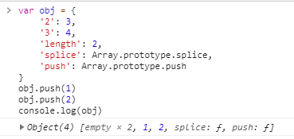

### 写在前面

> 此系列来源于开源项目：[前端 100 问：能搞懂 80%的请把简历给我](https://github.com/yygmind/blog/issues/43)
> 为了备战 2021 春招
> 每天一题，督促自己
> 从多方面多角度总结答案，丰富知识
> [输出以下代码执行的结果并解释为什么](https://github.com/Advanced-Frontend/Daily-Interview-Question/issues/74)
> 简书整合地址：[前端 100 问](https://www.jianshu.com/c/70e2e00df1b0)

#### 正文回答

```js
var obj = {
  2: 3,
  3: 4,
  length: 2,
  splice: Array.prototype.splice,
  push: Array.prototype.push,
};
obj.push(1);
obj.push(2);
console.log(obj);
```



##### 类数组（ArrayLike）

一组数据，由数组来存，但是如果要对这组数据进行扩展，会影响到数组原型，ArrayLike 的出现则提供了一个中间数据桥梁，ArrayLike 有数组的特性， 但是对 ArrayLike 的扩展并不会影响到原生的数组。

##### push 方法

push 方法具有通用性。该方法和 call() 或 apply() 一起使用时，可应用在类似数组的对象上。push 方法根据 length 属性来决定从哪里开始插入给定的值。如果 length 不能被转成一个数值，则插入的元素索引为 0，包括 length 不存在时。当 length 不存在时，将会创建它。

唯一的原生类数组（array-like）对象是 Strings，尽管如此，它们并不适用该方法，因为字符串是不可改变的。

原理：此时 length 长度设置为 0，push 方法从第 0 项开始插入，所以填充了第 0 项的 empty
