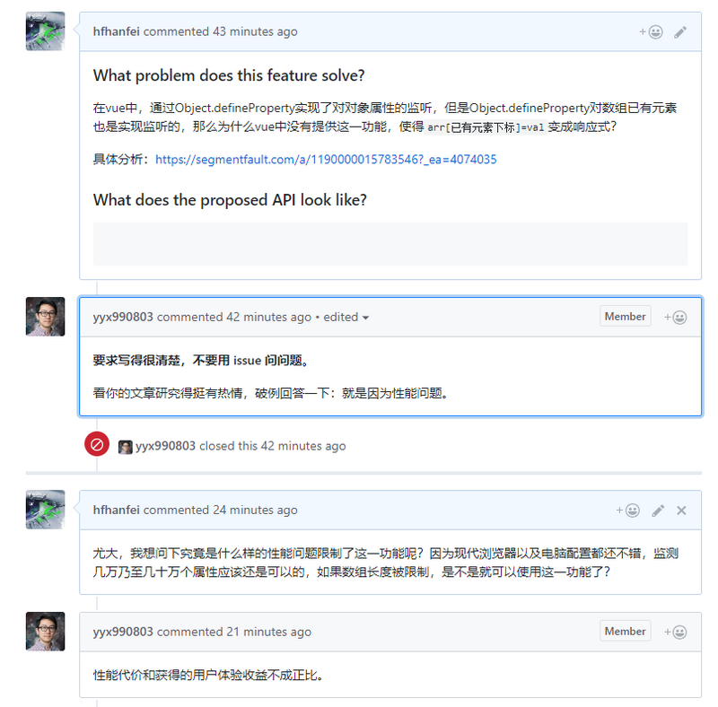

### 写在前面

> 此系列来源于开源项目：[前端 100 问：能搞懂 80%的请把简历给我](https://github.com/yygmind/blog/issues/43)
> 为了备战 2021 春招
> 每天一题，督促自己
> 从多方面多角度总结答案，丰富知识
> [Vue 的响应式原理中 Object.defineProperty 有什么缺陷？](https://github.com/Advanced-Frontend/Daily-Interview-Question/issues/90)
> 简书整合地址：[前端 100 问](https://www.jianshu.com/c/70e2e00df1b0)

#### 正文回答

另外一个问题：为什么在 Vue3.0 采用了 Proxy，抛弃了 Object.defineProperty？

1. `Object.defineProperty` 无法监控到数组下标的变化，导致通过数组下标添加元素，不能实时响应；
2. `Object.defineProperty` 只能劫持对象的属性，从而需要对每个对象，每个属性进行遍历，如果，属性值是对象，还需要深度遍历。`Proxy` 可以劫持整个对象，并返回一个新的对象。
3. `Proxy` 不仅可以代理对象，还可以代理数组。还可以代理动态增加的属性。

#### 补充回答

`Object.defineProperty` 本身有一定的监控到数组下标变化的能力，但是在 Vue 中，从性能/体验的性价比考虑，尤大大就弃用了这个特性。

图源：[记一次思否问答的问题思考：Vue 为什么不能检测数组变动](https://segmentfault.com/a/1190000015783546)
